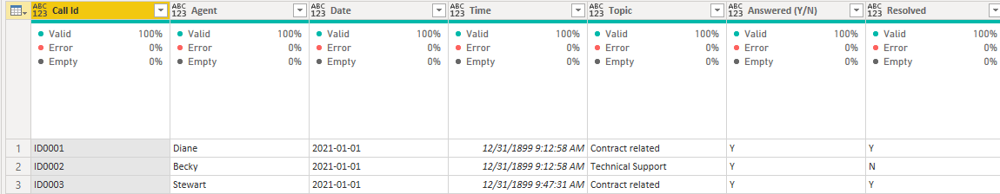
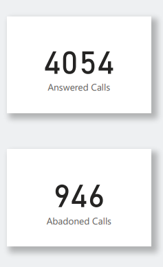
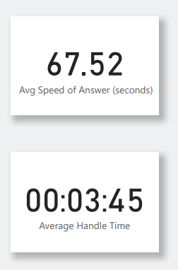

# PowerBI_Virtual_Case_Experience__Task_1

## Context

In this Virtual Case Experience, I worked as a Digital Accelerator for PwC. PwC aim to build innovative technology solutions that differentiate them from their competitors and digitize the business. As part of that, they made a strategic decision to invest in upskilling programs so their people could learn how to use digital tools for data visualization, as well as automation, data cleansing, and more.  

PwC’s client is a big telecom company, PhoneNow. In this first task, I worked with the call centre manager, Claire. She needed an accurate overview of trends in customer and agent behavior.  

## Task

Create a dashboard in Power BI for Claire that reflects all relevant Key Performance Indicators (KPIs) and metrics in the dataset.  

_The dataset contains 10 columns and 5000 rows. It contains calls that PhoneNow had received from January 1st 2021 to March 31st 2021._   

## Data Cleaning/Transformation  

The columns were _Call Id, Agent, Date, Time, Topic, Answered, Resolved, Speed of answer (in seconds), AvgTalkDuration, and Satisfaction rating._  

All the columns initially had text data types, I only had to change _the date, time, Speed of answer (in seconds) and AvgTalkDuration_ columns to their most appropriate data type which were date, time, whole number and time respectively.  
Also, I replaced *Y* and *N* in both the Resolved and Answered columns to *Yes* and *No* respectively.

## Analysis and Visualizatons  

First, I had to define the KPIs that could give an overview on both the agents' and customers' behavior as requested. Such as;  

•	Overall Calls answered/abandoned  
•	Overall Customer satisfaction  
•	Average speed of answer  
•	Agent’s performance quadrant i.e. average handle time (talk duration) vs calls answered  
•	Calls by time  

To get the overall calls answered and calls abandoned, I created two measures that filtered for when calls were answered represented as *Yes* and when they were abandoned represented as *No* in the Answered column.  

There were 4,054 answered calls and 946 abandoned calls. Why these calls were abandoned should be looked into.  

The average speed of answer is 67.52 seconds approximately 1 minute. It is shown that the average handle time for all the agents was 3 minutes and 45 seconds.  

Most customers’ satisfaction rating were mostly on the scale of 3 and 4.  

Calls related to streaming were mostly answered and it also has the least abandoned calls. Agents should be trained more on answering calls relating to technical support has it has the highest number of abandoned calls.  

Out of the eight (8) agents working at the Call Centre, Jim, Dan and Becky top the chart of resolved calls. However, every other agent has worked well as the difference is not glaring.  

The calls by time chart shows specific times of the day and the amount of calls that were received at the time. 1pm is the busiest hour in the day with 594 calls coming in that hour alone between January and March 2021.  

Interacting with the dashboard using the slicer shows specifically the average handle time per agent.  

